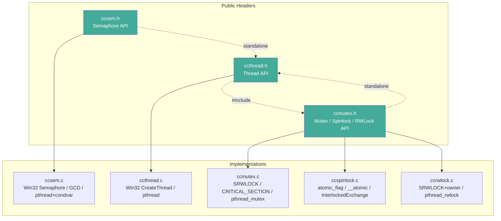
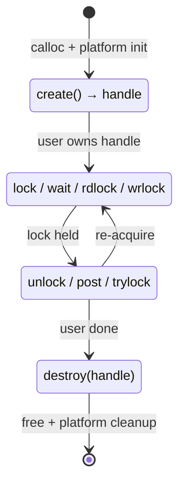
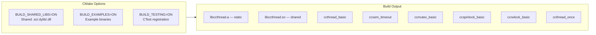
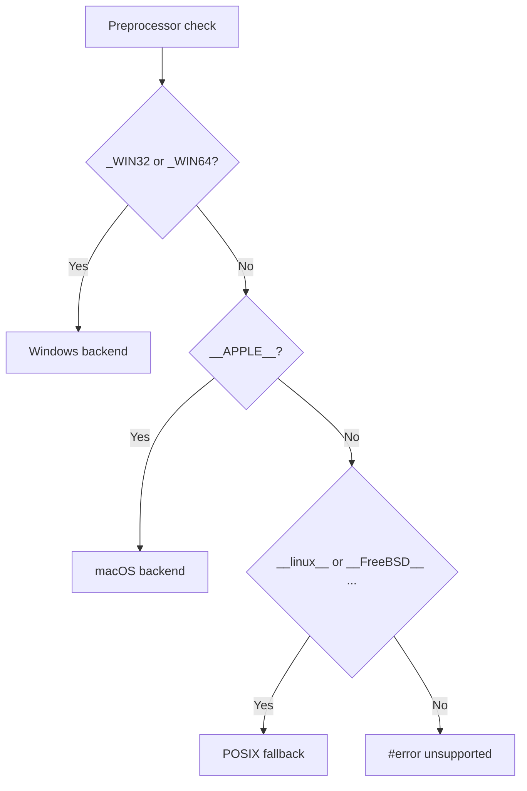

# ccthread — architecture overview



## Concurrency primitives

| Primitive | Backend (Windows) | Backend (macOS) | Backend (Linux / BSD) | QEMU-tested archs |
|-----------|-------------------|-----------------|----------------------|-------------------|
| **Thread** (`ccthread`) | `CreateThread` | `pthread` | `pthread` | ARM32 / AArch64 / PowerPC64 / MIPS64 / LoongArch64 |
| **Semaphore** (`ccsem`) | `CreateSemaphore` | GCD `dispatch_semaphore` | `pthread_mutex` + `pthread_cond` | ^^ |
| **Mutex** (`ccmutex`) | `SRWLOCK` / `CRITICAL_SECTION` | `pthread_mutex` | `pthread_mutex` | ^^ |
| **Spinlock** (`ccspinlock`) | `InterlockedExchange` | `atomic_flag` / `__atomic` | `atomic_flag` / `__atomic` | ^^ |
| **RWLock** (`ccrwlock`) | `SRWLOCK` + owner tracking | `pthread_rwlock` | `pthread_rwlock` | ^^ |
| **Once** (`ccthread_once`) | atomic state machine | atomic state machine | atomic state machine | ^^ |

## Ownership & lifecycle



## Build matrix



## Cross-platform detection



## Dependency graph

```
ccmutex.h  (standalone — defines ccrecursion_t, ccmutex_state_t)
  │
  ├── ccspinlock.c  ───┬── ccthread.h (for yield/self/equal)
  │                    └── ccmutex.h
  │
  ├── ccrwlock.c    ───┬── ccthread.h
  │                    └── ccmutex.h
  │
  └── ccmutex.c     ───┬── ccthread.h
                       └── ccmutex.h

ccsem.h    (standalone — defines its own CCTHREAD_API + ccmutex_state_t guard)
  │
  └── ccsem.c  ───┬── ccthread.h
                  └── ccsem.h

ccthread.h  (thread API — standalone, no extra includes)
  │
  └── ccthread.c  ───┬── ccatomic.h (once state machine)
                     └── ccthread_once (atomic state machine, no extra deps)
```

## Design decisions

- **Single library, multiple source files.** All primitives compile into one target (`libccthread`). Headers are standalone — each can be `#include`'d without pulling in unrelated APIs.
- **C99 + no GNU extensions.** Compiles with `-std=c99 -pedantic`. The spinlock uses `atomic_flag` when the compiler provides `<stdatomic.h>`; falls back to `__atomic` builtins or platform intrinsics — no C-standard version bump needed.
- **Static + shared.** Both `libccthread.a` and `libccthread.so` / `ccthread.dll` are produced from the same object code. PIC is enabled for the static library so it can be linked into shared libraries.
- **Opaque structs.** All `typedef struct x_impl x_t` are defined in the `.c` files. Public headers only expose forward declarations.
- **Return codes.** `CCMUTEX_SUCCESS` (0), `CCMUTEX_ERROR` (-1), `CCMUTEX_TIMEOUT` (-2 for semaphore). No `errno`.
- **Thread ID.** `ccthread_gettid(NULL)` returns the calling thread's OS TID; `ccthread_gettid(thread)` reads the TID from a thread handle.
